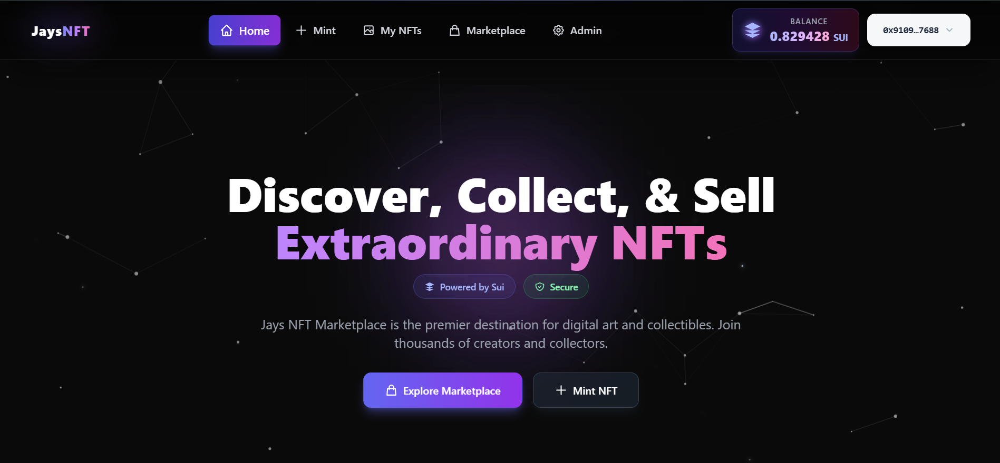
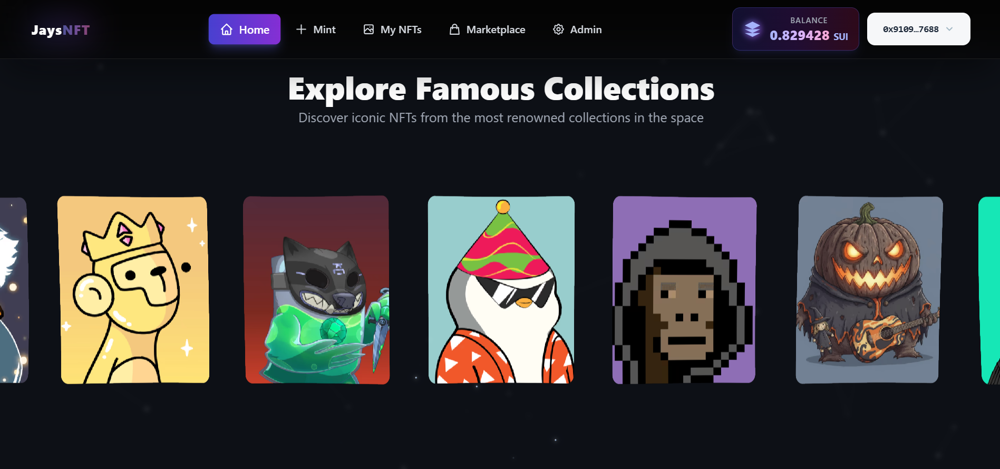
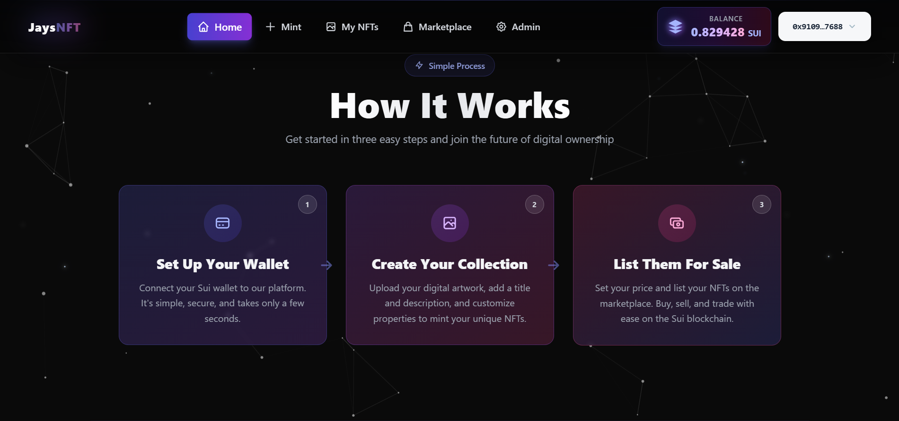
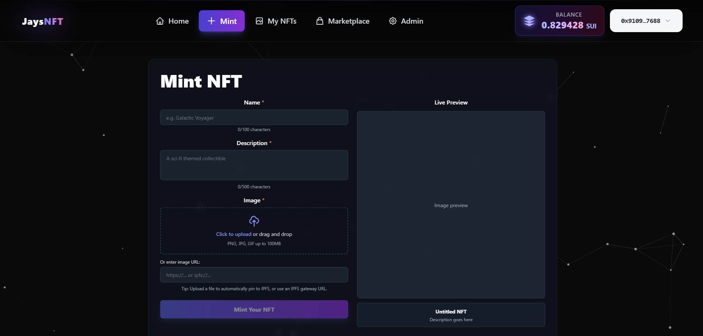
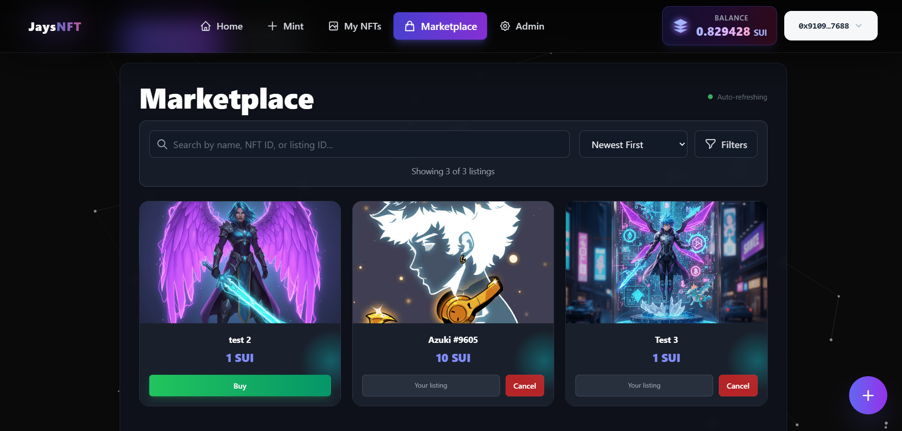
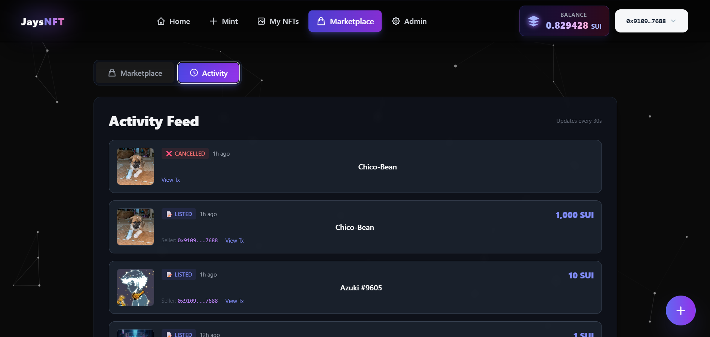
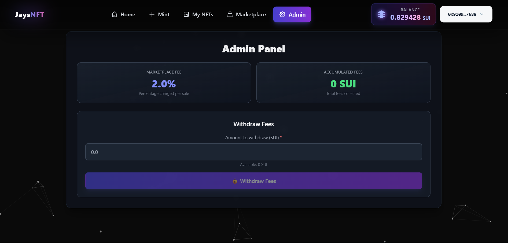
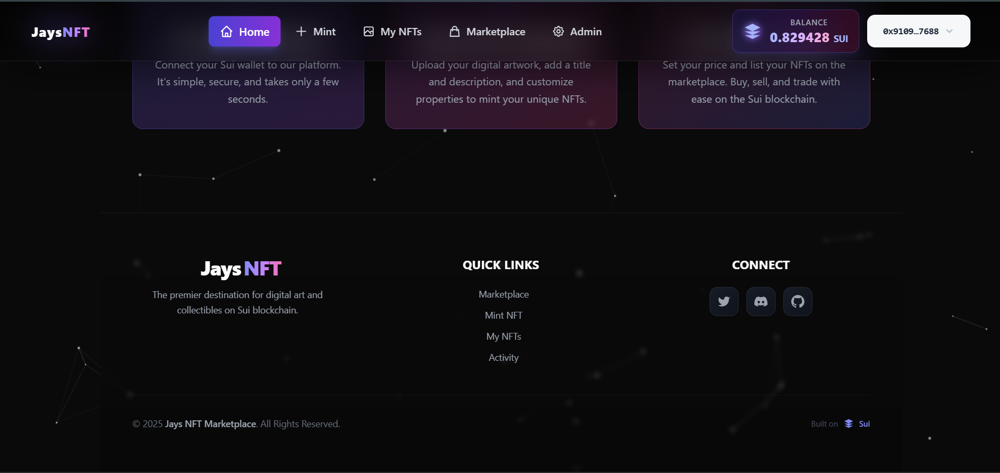

# 🎨 JaysNFT Marketplace

A premium, modern NFT marketplace built on the Sui blockchain. Discover, collect, and sell extraordinary NFTs with a beautiful, responsive interface featuring animations, premium styling, and seamless wallet integration.

## 🌐 Live Demo

**Deployed Application:** [JaysNFT Marketplace](https://jaysnft.vercel.app/)
<!-- Example: https://your-deployed-app.vercel.app -->

---

## ✨ Features

### 🏠 **Premium Landing Page**
- Animated gradient backgrounds and glowing effects
- Interactive NFT gallery with 3D circular carousel
- "How It Works" section with premium step cards
- Smooth animations and transitions throughout
- Modern badge system with tooltips

### 🎯 **Core Functionality**
- **Wallet Integration**: Connect with Sui Wallet, Suiet, or any compatible wallet
- **NFT Minting**: Create and mint your own NFTs with image uploads or IPFS URLs
- **Marketplace**: List, browse, buy, and cancel NFT listings
- **My NFTs**: View and manage your NFT collection
- **Activity Feed**: Track all marketplace activities (listings, sales, cancellations)
- **Admin Panel**: Manage marketplace fees and withdraw accumulated fees

### 🎨 **Design Features**
- Premium modern UI with gradient effects
- Animated star borders on NFT cards
- Responsive design for mobile and desktop
- Dark theme with constellation background
- Interactive tooltips and hover effects
- Professional navbar with enhanced balance display

---

## 📸 Screenshots

### Home Page - Hero Section

*Premium landing page with animated hero section featuring gradient backgrounds and call-to-action buttons*

### Explore Famous Collections

*Interactive 3D circular gallery showcasing iconic NFTs from renowned collections*

### How It Works

*Premium step-by-step guide with animated cards explaining the process of getting started*

### Mint NFT Page

*Easy-to-use minting interface with live preview, image upload, and IPFS integration*

### My NFTs Page

*View and manage your NFT collection with star border effects*

### Marketplace Page

*Browse and search NFTs with advanced filters, sorting, and real-time updates*

### Activity Feed

*Track all marketplace activities including listings, sales, and cancellations*

### Admin Panel

*Manage marketplace settings, view fees, and withdraw accumulated fees*

### Premium Footer

*Modern footer with quick links, social media, and brand information*

---

## 🛠️ Tech Stack

- **Framework**: React 19 with TypeScript
- **Styling**: Tailwind CSS with custom animations
- **Blockchain**: Sui Blockchain
- **Wallet Integration**: @mysten/dapp-kit
- **Routing**: React Router DOM
- **3D Gallery**: OGL (WebGL library)
- **IPFS**: Pinata for image pinning

---

## 📋 Features Breakdown

### NFT Minting
- Upload images directly to IPFS via Pinata
- Automatic IPFS pinning with CID generation
- Alternative option to use existing image URLs
- Real-time preview of NFT metadata
- Character limits and validation

### Marketplace
- Advanced search by name, NFT ID, or listing ID
- Price filtering (min/max)
- Sorting options (newest, oldest, price low/high)
- Real-time auto-refresh every 15 seconds
- Owner-specific actions (cancel listings)
- Star border effects on all NFT cards

### Activity Feed
- Comprehensive event tracking
- Displays listings, sales, and cancellations
- Real-time updates
- Deduplication of events
- Transaction history with timestamps

### Admin Panel
- View marketplace fee percentage
- Monitor accumulated fees
- Withdraw fees (admin only)
- Secure access control

---

## 📄 License

**MIT**

---

## 🔗 Links

- **Live Demo**: [JaysNFT Marketplace](https://jaysnft.vercel.app/)
- **Sui Blockchain**: https://sui.io
- **Pinata IPFS**: https://pinata.cloud

---

## 💬 Support

For issues, questions, or contributions, please open an issue on GitHub.

---

**Built with ❤️ on Sui Blockchain**
